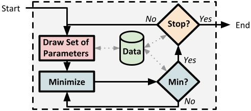
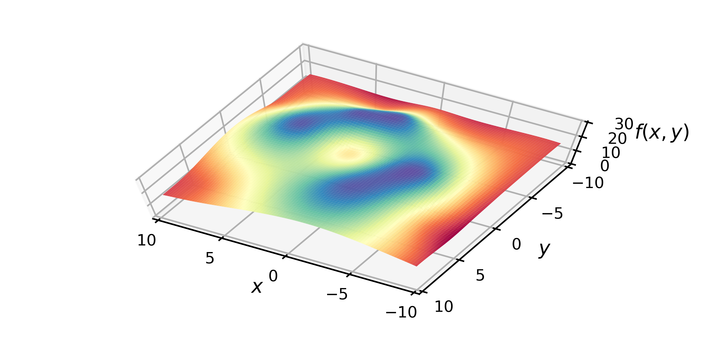
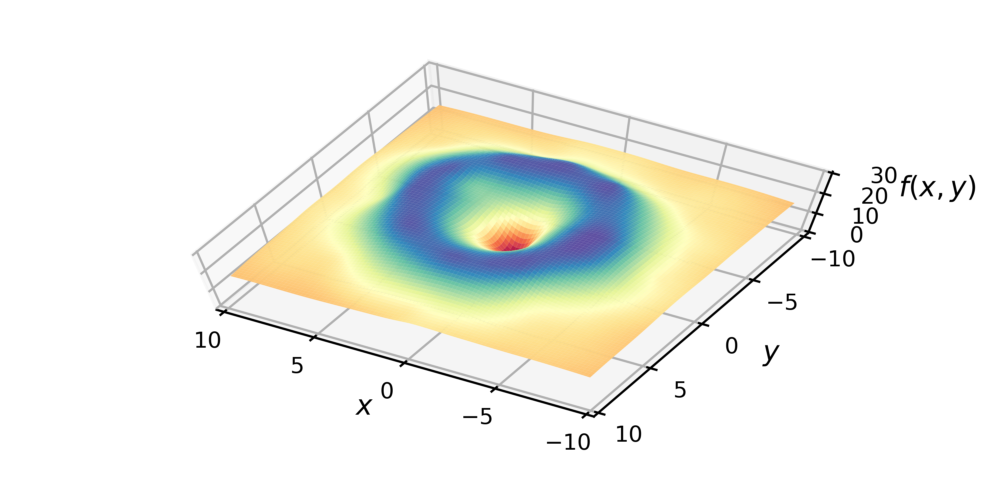
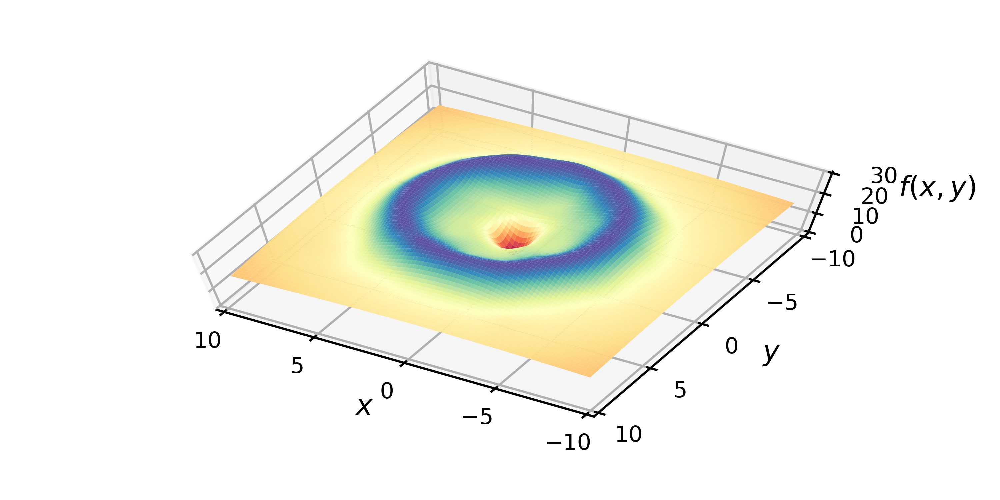
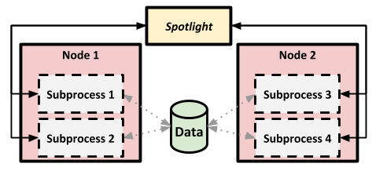

Introduction
============

.. contents:: :local:

Rietveld analysis of tens or hundreds of powder diffraction datasets from parametric or time-resolved experiments often poses a bottleneck.
High temperature annealing studies, during which phase transformations occur and lattice parameters may change due to repartitioning of elements, are prime examples where automation by a simple phase identification from a database of room temperature structures or automation by sequential refinements is likely to fail. 
To address this problem, we present a Python packaged named **Spotlight** which uses an *ensemble of optimizers* to guide the analysis to the best fit parameters over many subprocesses and across machines which allows the analyst to harness the computational capacity of high-performance computing clusters for Rietveld analyses.
The parallel execution of many refinements with varying starting values enables: the prediction of initial parameter values for designing refinement plans and identification of phases.

Spotlight maps the response surface of an arbitrary parameter space using an ensemble of optimizers.
The parameter space is sampled at 16 points and at each point a local optimization algorithm is executed to find the local minimum or maximum as illistrated below.
The results are stored in a database that can be used to query results or design more complex sampling algorithms to pick initial points, termination conditions to stop the local optimization, or constraints.

By executing many optimizers, we can interpolate the response surface from the database.
Below we show the interpolated model of a two-dimensional volcano function, denoted ``f(x,y)``.
The more local optimizations (i.e. more points sampled) then the higher the arrcuracy of our interpolated model of the surface.
From left to right: 16 local optimizations (8 to find minimums and 8 to find maximums), 32 local optimizations (16 to find minimums and 16 to find maximums), and 128 local optimizations (64 to find minimums and 64 to find maximums).

For Rietveld refinements, this same strategy can map the chi-squared or R-factor surface where the global minimum of the surface corresponds the best-fit parameters.

To execute these optimizations algorithms we use *Mystic* which is a framework to simplify non-convex optimization problems by transforming away nonlinearities through user-built kernel transforms.

Using packages like Mystic, in conjunction with supporting packages ``pathos`` and ``pyina``, we can provide massively-parallel scalable workflows for quickly solving optimization problems in complex, nonlinear spaces.
This is illustrated below.

The following pages of this tutorial demonstrates:
 * How to install Spotight,
 * How to use Mystic which is the optimization framework Spotlight uses to map response surfaces,
 * How to execute these ensembles in parallel,
 * How to create a surrogate model and use the surrogate model to optimize an expensive cost function,
 * And how to apply what we have learned to a Rietveld analysis using **MILK** which is interface to the MAUD Rietveld software.

.. note::

    This tutorial is written using Python notebooks in ``spotlight/docs/notebooks``.
    You can create a server to load the notebooks using ``python -m notebook``.

